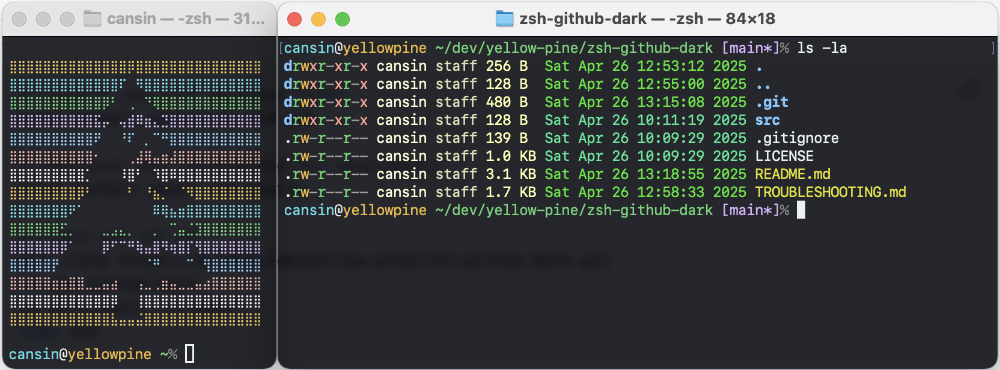

# zsh-github-dark

[](LICENSE)
[](https://www.zsh.org/)
[](https://github.com/yellow-pine)

Minimalistic macOS zsh and Terminal configuration optimized for GitHub Dark themes.  
Designed for clarity, speed, and a visually cohesive development environment.

## 🎨 Terminal Preview

Here's a preview of the final setup:



## 🚀 Quick Start

```bash
# Install required packages first
brew install coreutils lsd zsh

# (Optional but recommended for developers)
brew install pyenv nvm poetry

# Clone and set up
git clone https://github.com/yellow-pine/zsh-github-dark.git
cd zsh-github-dark
cp src/.zshrc ~/.zshrc
exec zsh
```

✅ You are now fully set up!

## 🛠 Requirements Before Installation

Make sure the following tools are installed (via Homebrew preferred):

```bash
brew install coreutils lsd zsh
```

If you work with Node.js, Python, or GitHub daily, it's also recommended to install:

```bash
brew install pyenv nvm poetry
```

## 📦 Full Installation Steps

1. **Install required packages (if not already installed):**

    ```bash
    brew install coreutils lsd zsh
    brew install pyenv nvm poetry  # optional but recommended
    ```

2. **Clone the repository:**

    ```bash
    git clone <https://github.com/yellow-pine/zsh-github-dark.git>
    cd zsh-github-dark
    ```

3. **Copy the `.zshrc` into your home directory:**

    ```bash
    cp src/.zshrc ~/.zshrc
    ```

4. **Import the Terminal profile:**

    - Open Terminal ➔ Settings ➔ Profiles ➔ Import
    - Select the file `src/github-dark.terminal`
    - Set it as the Default profile if desired

5. **Reload your shell:**

    ```bash
    exec zsh
    ```

## ✨ Features

- GitHub Dark-optimized zsh prompt
- Git branch awareness, last command timing, and error status
- Human-readable `lsd` output with matching color theme
- Clean handling of personal vs. organizational Git identities
- No plugins, no bloated frameworks — pure native zsh

## 🎨 Terminal Theme Details

- Based on [GitHub Dark – terminalcolors.com](https://terminalcolors.com/themes/github/dark/)
- Minor tweaks applied:
  - Font size set to 12
  - Background opacity set to 85%
  - Cursor color adjusted to match "Bold Text" instead of default orange
- File provided: `src/github-dark.terminal`

## 🌐 Project Structure

```plaintext
zsh-github-dark/
├── src/
│   ├── .zshrc                  # The main zsh configuration
│   └── github-dark.terminal    # The customized Terminal profile
├── README.md
├── LICENSE
├── .gitignore
```

## 🔵 Troubleshooting

If something doesn't work as expected, check [TROUBLESHOOTING.md](TROUBLESHOOTING.md) for help.

## 📫 Contact

For feedback, ideas, or contributions:  
**<hello@yellowpine.com>**

## ⚡ License

This project is licensed under the [MIT License](LICENSE) — free for personal and commercial use.  
Authored and maintained by **Cansin Yildiz**.
